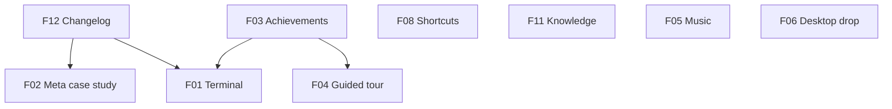

# JaiOS — Feature Roadmap (v2)

**Created:** 2026-07-19  
**Status:** planning reference — build one feature at a time via SDLC handoffs  
**How to use:** Pick the next feature in **Build order**, create `.sdlc/<slug>.md` from `TEMPLATE.md`, fill todos, ship end-to-end, then add a Changelog entry (F12).

---

## Build order (recommended first → last)

| # | ID | Feature | Effort | Why this order |
|---|-----|---------|--------|----------------|
| 1 | F12 | Blog / Changelog timeline | M | Document features as you ship them; proves consistency |
| 2 | F01 | Terminal command expansion | S–M | Quick win on existing app; highly shareable |
| 3 | F03 | Achievement / clearance system | M | Shared discovery layer for Secret, tour, easter eggs |
| 4 | F04 | Guided tour (Recruiter mode) | M | High recruiter ROI; uses Spotlight + achievements |
| 5 | F02 | “How I built JaiOS” meta case study | M | Pairs with changelog; your strongest technical story |
| 6 | F08 | Keyboard shortcuts++ | S | Small polish; improves power-user feel |
| 7 | F11 | Knowledge sharing | L | Tool & library recommendations — CSS, AI, dev tools |
| 8 | F05 | Music / ambient sound app | M | Extends existing sound engine; atmosphere |
| 9 | F06 | Drag-and-drop desktop files | M | OS realism; unlocks Text Viewer + future Trash |

**Effort key:** S ≈ &lt;2h · M ≈ 2–5h · L ≈ half day+

---

## Cross-cutting conventions

- **New apps:** register in `data/apps.ts`, `components/os/appRegistry.tsx`, `components/os/AppIcon.tsx`; add to Finder or Launchpad as appropriate.
- **Persistence:** achievements, tour progress, changelog “read” state, music prefs → `localStorage` with typed keys (`jaios-*`).
- **Sounds:** reuse `lib/sounds.ts`; respect `soundEnabled` and DND from `os-store`.
- **Changelog rule:** every shipped feature from this roadmap gets one entry in F12 before moving to the next.

---

## F12 — Blog / Changelog timeline

**Slug:** `changelog-app`  
**Effort:** M  
**Depends on:** nothing (build first)

### One-line goal
A Timeline app that shows **when and what** was shipped to JaiOS — each release/commit theme documented as you build.

### Why it matters
Shows consistency, iteration, and maintenance mindset. Recruiters see you don’t just ship once — you evolve the product (PWA, Secret folder, Finder hub, etc.).

### In scope
- New app **“Changelog”** (or “Timeline”) in Finder + Launchpad
- Vertical timeline UI: date, version/tag, title, bullet summary, optional tags (`feature`, `pwa`, `easter-egg`, `polish`)
- Data-driven from `data/changelog.ts` (array of entries — **you append per feature ship**)
- Filter chips: All · Features · Fixes · Easter eggs
- Detail view: expandable card with “what changed” + “why it matters” (1–2 sentences)
- Optional: link entry to related app id (`openApp('terminal')` button)

### Out of scope
- Auto-generating from git commits (manual curated entries are fine; optional script later)
- Comments / RSS / external CMS

### Acceptance criteria
- [ ] At least 8 seed entries covering existing JaiOS history (boot, Finder hub, easter eggs, PWA, Secret v2, etc.)
- [ ] New entries are a single object in `data/changelog.ts`
- [ ] Works offline (static data)
- [ ] Mobile-friendly scroll

### Files likely involved
- `data/changelog.ts` (new)
- `components/apps/ChangelogApp.tsx` (new)
- `data/apps.ts`, `appRegistry.tsx`, `FinderApp.tsx` or sidebar link

### Seed entry template
```ts
{
  id: "pwa-offline",
  date: "2026-07-19",
  version: "1.4.0",
  title: "Offline-first PWA",
  tags: ["feature", "pwa"],
  summary: "Serwist service worker, install prompt, offline guards.",
  body: ["Precache app shell...", "Browser shows offline state instead of broken iframe."],
  relatedApp: "settings",
}
```

---

## F01 — Terminal command expansion

**Slug:** `terminal-commands`  
**Effort:** S–M  
**Depends on:** nothing

### One-line goal
Turn Terminal into a **playful CLI for the portfolio** — open apps, query skills, toggle theme, print system info.

### Why it matters
Memorable, shareable, demonstrates CLI UX and string parsing without a backend.

### In scope — new commands
| Command | Behavior |
|---------|----------|
| `help` | Grouped commands: navigation · portfolio · system · fun |
| `open <app>` | Already exists — keep |
| `skills [--filter <term>]` | List skills from `data/skills.ts` |
| `projects` | Table of project titles |
| `contact` | Email, LinkedIn, GitHub |
| `theme light\|dark` | Calls `setTheme` |
| `wallpaper <id>` | If valid wallpaper id |
| `neofetch` | ASCII logo + fake specs |
| `sysinfo` | Live system readout (theme, wallpaper, apps, achievements) |
| `achievements` | List unlocked badges with progress |
| `changelog` | Print last 3 entries (after F12; stub until then) |
| `clear` | Already exists |
| `sudo rm -rf /` | Keep BSOD easter egg |

### Out of scope
- Real shell execution
- Network requests

### Acceptance criteria
- [ ] `help` documents all commands
- [ ] Unknown command → friendly error + hint
- [ ] Arrow-up/down history (already exists)
- [ ] Tab completion (nice-to-have, optional phase 2)

### Files likely involved
- `components/apps/TerminalApp.tsx`
- `store/os-store.ts` (theme actions)
- `data/skills.ts`, `data/projects.ts`

---

## F03 — Achievement / clearance system

**Slug:** `achievements`  
**Effort:** M  
**Depends on:** nothing (Secret clearance is v1 — extend globally)

### One-line goal
OS-wide **achievement badges** tied to discovery and craft — extend Secret’s clearance meter into a full system.

### Why it matters
Gamifies exploration; rewards curiosity (your brand). Connects Secret, Terminal, tour, BSOD, PWA install.

### In scope
- `data/achievements.ts` — id, title, description, icon, tier (`bronze`/`silver`/`gold`), `hidden` flag
- `store/achievement-store.ts` or extend `os-store` with `unlockedAchievements: Set<string>`
- Persist `jaios-achievements` in localStorage
- **Unlock triggers** (examples):
  - `first-boot` — complete login
  - `spotlight-user` — open Spotlight
  - `signal-clear` — decode Secret transmission (migrate from `jaios-secret`)
  - `full-clearance` — all dossier lines (migrate)
  - `kernel-panic` — run `sudo rm -rf /`
  - `snake-charmer` — score ≥ 10 in Snake
  - `offline-operator` — open app while `navigator.onLine === false`
  - `installed` — `display-mode: standalone` or install prompt accepted
  - `tour-complete` — finish guided tour (F04)
- **UI:** “Achievements” pane inside System Monitor OR standalone app
- Toast + `playSound('notify')` on unlock
- Secret folder shows total unlocked count

### Out of scope
- Leaderboards / accounts
- Backend sync

### Acceptance criteria
- [x] 12+ achievements defined
- [x] Unlock persists across reloads
- [x] Hidden achievements don’t show title until unlocked
- [x] `achievements` terminal command lists unlocked

### Files likely involved
- `data/achievements.ts` (new)
- `lib/achievements.ts` — `unlock(id)`, `checkAndUnlock(id)`
- `components/apps/SystemMonitorApp.tsx` or `AchievementsApp.tsx`
- `components/apps/SecretApp.tsx` (migrate clearance state)
- Hooks in `JaiOS.tsx`, `TerminalApp.tsx`, `SnakeApp.tsx`, `SerwistRegister.tsx`

---

## F04 — Guided tour (Recruiter mode)

**Slug:** `guided-tour`  
**Effort:** M  
**Depends on:** F03 (optional achievement on complete)

### One-line goal
A **60-second scripted walkthrough** for recruiters — Spotlight steps highlight Finder, best case study, contact.

### Why it matters
Many visitors spend &lt;2 minutes. Tour = you control the narrative.

### In scope
- “Take a tour” CTA: boot screen (skip), Help menu, first-visit banner (dismissible)
- 5–7 steps with spotlight overlay (dim rest of screen, highlight target)
- Steps example:
  1. Welcome — “This is JaiOS, my portfolio as an operating system.”
  2. Dock — Finder
  3. Finder → Work section
  4. Open a case study highlight
  5. Contact / Resume
  6. Easter egg hint (sparkle bottom-left) — optional
  7. Done — “Want to hire me?” + Contact button
- Progress dots, Skip, Back, Next
- Persist `jaios-tour-done` in localStorage
- `usePrefersReducedMotion` — instant transitions if reduced

### Out of scope
- Video recordings
- Per-user analytics

### Acceptance criteria
- [x] Tour completable in under 90 seconds
- [x] Skip works at any step
- [x] Doesn’t break window focus / z-index
- [x] Unlocks `tour-complete` achievement

### Files likely involved
- `components/os/GuidedTour.tsx` (new)
- `data/tour-steps.ts` (new)
- `JaiOS.tsx`, `TopBar.tsx` (Help menu)
- `store/os-store.ts` — `tourOpen`, `tourStep`

---

## F02 — “How I built JaiOS” meta case study

**Slug:** `meta-case-study`  
**Effort:** M  
**Depends on:** F12 helpful but not required

### One-line goal
A **technical case study about the portfolio itself** — architecture, trade-offs, stack, lessons.

### Why it matters
This *is* the senior frontend signal: you can explain your own system design.

### In scope
- New Finder section **“Building JaiOS”** (or dedicated app)
- Sections:
  - **Overview** — why OS metaphor
  - **Architecture** — Next.js App Router, client OS shell, Zustand, Framer Motion
  - **State** — windows, z-index, persistence, localStorage
  - **Performance** — bundle, `optimizePackageImports`, PWA precache
  - **Offline** — Serwist, what works / what doesn’t
  - **Accessibility** — reduced motion, keyboard, ARIA
  - **Trade-offs** — why not Electron, why manual changelog vs CMS
  - **Diagram** — mermaid or simple ASCII in content
- Reuse `finderSections.tsx` / `SectionDoc` pattern

### Out of scope
- Live architecture auto-diagram from codebase

### Acceptance criteria
- [x] Readable in 5–8 minutes
- [x] At least one architecture diagram
- [x] Links to GitHub repo
- [x] Offline-safe static content in `data/meta-case-study.ts`

### Files likely involved
- `data/meta-case-study.ts` (new)
- `data/sections.ts` — add section id
- `components/apps/finderSections.tsx` — `BuildingJaiOSSection`
- `FinderApp.tsx` router

---

## F08 — Keyboard shortcuts++

**Slug:** `shortcuts-plus`  
**Effort:** S  
**Depends on:** nothing

### One-line goal
Upgrade Shortcuts panel to **searchable, categorized, complete** — every shortcut in one place.

### Why it matters
Power users and recruiters who press keys notice polish.

### In scope
- Move shortcuts to `data/shortcuts.ts` with `category`: Navigation · Windows · Apps · System
- Search input filters list
- Add missing shortcuts: Mission Control (F3), App Switcher, lock, spotlight actions, window close/min/max
- Show **⌘ vs Ctrl** based on platform (`navigator.platform`)
- Optional: “Practice mode” — highlight key badge when user presses matching key (stretch goal)

### Out of scope
- Remappable bindings

### Acceptance criteria
- [x] 15+ shortcuts documented
- [x] Search filters live
- [x] Matches actual `use-keyboard-shortcuts.ts` behavior

### Files likely involved
- `data/shortcuts.ts` (new)
- `components/os/ShortcutsPanel.tsx`
- `hooks/use-keyboard-shortcuts.ts` (read for parity)

---

## F11 — Knowledge sharing (tool recommendations)

**Slug:** `knowledge`  
**Effort:** L  
**Depends on:** nothing

### One-line goal
A **curated knowledge base** of tools and libraries you recommend — CSS, frameworks, AI libs, dev tools, Chrome extensions, Cursor, Claude Code.

### Why it matters
Shows how you actually work — not just what you built, but what you reach for daily.

### In scope
- New app **“Knowledge”** (icon: `bookOpen`)
- Sidebar sections:
  1. **CSS** — fundamentals, MDN, learning resources
  2. **CSS frameworks** — Tailwind, shadcn, MUI, Framer Motion
  3. **AI libraries** — Vercel AI SDK, Zod, TanStack Query
  4. **AI tools** — Cursor, Copilot, v0, Bolt, CodeRabbit, Continue, Windsurf
  5. **Dev tools** — Chrome DevTools, React DevTools, TypeScript, Lighthouse
  6. **Chrome extensions** — React DevTools, WhatFont, ColorZilla, JSON Formatter
  7. **Workflow tools** — pnpm, Figma, Vercel, GitHub
- Data: `data/knowledge.ts` — structured, easy to append
- Each item: title, tags, summary, personal recommendation, optional link

### Out of scope
- Full wiki / user comments
- Auto-syncing tool lists from the web

### Acceptance criteria
- [x] 20+ items across sections
- [x] Search across titles + tags
- [x] Each item: title, tags, summary, recommendation, optional link
- [x] Launchpad + Spotlight entry

### Files likely involved
- `data/knowledge.ts` (new)
- `components/apps/KnowledgeApp.tsx` (new)
- `data/apps.ts`, `appRegistry.tsx`

---

## F05 — Music / ambient sound app

**Slug:** `ambient-sound`  
**Effort:** M  
**Depends on:** existing `lib/sounds.ts`, `soundEnabled` in store

### One-line goal
A **mini Music app** for focus ambiences — rain, keyboard, lo-fi loop (optional).

### Why it matters
Extends the OS fantasy; shows Web Audio API comfort.

### In scope
- App **“Music”** or **“Ambience”**
- 3–4 tracks: Rain, White noise, Keyboard clicks, Silent (off)
- Looping ambient beds via Web Audio or `<audio loop>` from `public/audio/*.mp3` (small files)
- Volume slider synced with Control Center brightness-style UI
- Persist last track + volume in `jaios-ambience`
- Respect master `soundEnabled`; pauses when DND on

### Out of scope
- Spotify integration
- Large audio files (&gt;500KB each — keep tiny or synthesized)

### Acceptance criteria
- [x] Switch tracks without reload
- [x] Volume persists
- [x] No audio when sound disabled in Settings
- [x] Visualizer bar (fake spectrum) — optional polish

### Files likely involved
- `components/apps/MusicApp.tsx` (new)
- `lib/ambience.ts` (new) — Web Audio oscillators or HTMLAudio
- `public/audio/` (new, small assets)
- `ControlCenter.tsx` — optional quick link

---

## F06 — Drag-and-drop desktop files

**Slug:** `desktop-drop`  
**Effort:** M  
**Depends on:** Text Viewer app (exists)

### One-line goal
Drop a **`.txt` file on the desktop** → it opens in Text Viewer; optional desktop icon for dropped file.

### Why it matters
Classic OS affordance; activates dormant Text Viewer infra.

### In scope
- Desktop `onDragOver` / `onDrop` handlers
- Accept `.txt` only (first version)
- Read via `FileReader`, pass content to `openFile(id)` or new store action `openTextContent(name, content)`
- Show ephemeral desktop icon or toast “Opened filename.txt”
- Invalid file type → toast error

### Out of scope
- PDF drop, image drop (v2)
- Trash / Bin (future roadmap item)

### Acceptance criteria
- [ ] Drop .txt → Text Viewer opens with content
- [ ] Drag overlay hint on desktop
- [ ] Works on desktop layout only (not mobile grid)

### Files likely involved
- `components/os/Desktop.tsx`
- `store/os-store.ts` — `openTextContent` or extend `openFile`
- `components/apps/TextViewerApp.tsx`

---

## Per-feature SDLC workflow

When starting a feature:

1. Copy `.sdlc/TEMPLATE.md` → `.sdlc/<slug>.md`
2. Fill Scope + Plan from this doc
3. Run scope-analyst → planner → implementer → tester → impact-checker → shipper
4. **Append changelog entry** in `data/changelog.ts` (F12)
5. Mark feature done in this file (checkbox below)

### Progress tracker

- [x] F12 Changelog timeline
- [x] F01 Terminal commands
- [x] F03 Achievements
- [x] F04 Guided tour
- [x] F02 Meta case study
- [x] F08 Shortcuts++
- [x] F11 Knowledge
- [x] F05 Ambient sound
- [ ] F06 Desktop drop

---

## Dependency graph



---

## Notes for Jai

- **Content is half the work** for F02, F11, F12 — block time for writing, not just coding.
- Ship **F12 first** so every future feature documents itself.
- **F11 (Knowledge)** — keep recommendations personal and current; add tools as your stack evolves.
- Keep easter eggs connected via **F03** so discovery feels intentional, not random.
- After each ship, add a screenshot to `public/screenshots/` for PWA install UI (optional polish from PWA plan).
